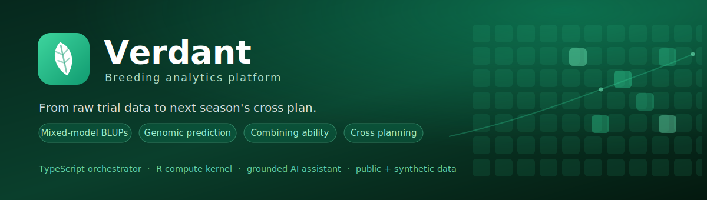

# Verdant — Breeding Analytics (teaching + portfolio project)

A free, open-source breeding **management + analysis** project. Upload a trial → get correct
mixed-model **BLUPs/BLUEs**, **heritability**, genomic **GEBVs**, **combining ability**, and a live,
re-weightable **selection ranking** — with a pre-fit **data-quality** pass and post-fit **model-QC**
diagnostics so you can trust the answer, all narratable by a grounded **AI assistant** that only
answers from the computed result bundle.

Read [PRODUCT.md](PRODUCT.md), [ROADMAP.md](ROADMAP.md), [docs/MVP-PLAN.md](docs/MVP-PLAN.md), the
shared vocabulary in [CONTEXT.md](CONTEXT.md), and the decisions in [docs/adr/](docs/adr/).

> *Personal project, built on my own time and equipment using publicly available or
> self-collected data. Not affiliated with, funded by, or derived from any employer's
> work, data, or systems.*

## Architecture (ADR-0001, ADR-0012)

```
apps/web (Next.js + TS)  ──▶  packages/pipeline (TS orchestrator)  ──▶  services/kernel (R compute kernel)
   journey UI + AI chat        runs the analysis, assembles the bundle      the ONLY place statistics happen
        │                                  │                                          │
        └────────── Postgres (result bundles stored whole as JSONB) ──────────────────┘
```

The **engine contract** (`packages/contracts/`, versioned JSON Schema) is the language-neutral seam: an
`analyze()` **request** in, a **result bundle** out. R owns all model selection + science deterministically
(ADR-0002); TS owns orchestration, the GUI, and AI; the AI explains the bundle, never computes it.

## Layout (monorepo)

| Path | Purpose |
|---|---|
| `apps/web/` | **The live web tier** — Next.js journey UI (Overview → Data → Model → Understand → Select → Advance → Genomics) + AI assistant. |
| `packages/contracts/` | Versioned engine contract (JSON Schema → generated TS types). The TS↔R seam. |
| `packages/pipeline/` | TS orchestrator: parses data, calls the R kernel, assembles + persists the result bundle (`met-build.ts` is the MET entrypoint). |
| `packages/db/` | Postgres schema (Drizzle): programs, studies, observations, analysis runs, result bundles, genotyping (BrAPI-aligned). |
| `services/kernel/` | **R compute kernel** — `analyze.R`, `stage1-spatial.R`, `model-qc.R`, `data-quality.R`, `plan.R`, `combining-ability.R`, genomic-`*.R`. Stateless; stdin JSON → stdout JSON. |
| `services/engine-blupf90/` | Native BLUPF90/preGSf90 binaries (AI-REML, GBLUP/ssGBLUP scale engine). |
| `data/g2f/` | The G2F maize dev fixtures (the development north-star dataset, ADR-0008). |
| `docs/` | ADRs, DOMAIN-MODEL, MVP-PLAN, validation reports, agent guides. |
| `evals/` | AI groundedness eval harness. |

## Run it

> `pnpm` is invoked via **`corepack pnpm`** on this machine (it's not on PATH). Needs Node ≥22, R 4.6+
> (jsonlite, lme4, SpATS), and Postgres. The R kernel runs as a subprocess; native BLUPF90 binaries live
> in `services/engine-blupf90/bin/`.

```bash
corepack pnpm install                                   # workspace deps

# 1. Postgres (local DB named `verdant`; see .env for DATABASE_URL) must be running + migrated.
# 2. Produce a result bundle from the G2F MET fixture (parses → fits → genomic → combining ability →
#    QC → persists to Postgres). ~minutes (genomic CV is the slow part).
corepack pnpm --filter @verdant/pipeline exec tsx src/met-build.ts

# 3. Run the web app — it reads the latest persisted bundle from Postgres.
corepack pnpm --filter @verdant/web dev                 # http://localhost:3000
```

Set `ANTHROPIC_API_KEY` (in `.env`, see `.env.example`) to enable the AI chat; without it the analysis
works fully and the assistant reports it isn't configured.

## Tests

```bash
corepack pnpm test            # contracts (schema/examples) + R kernel (correctness, data-quality, model-qc) + AI evals
corepack pnpm contracts:test  # just the engine contract
corepack pnpm test:kernel     # just the R kernel suites
```

The kernel correctness suite (`services/kernel/tests/correctness.R`) feeds known-truth simulated MET data
through the real seam and asserts the BLUPs recover the true genetic values — the core guarantee, made re-runnable.

## Status (2026-06-13)

The analysis engine is built and validated on the **G2F maize MET**, end to end:

- **Two-stage MET** — SpATS within-environment spatial de-trending → multi-trait AI-REML (BLUPF90),
  validated vs lme4 to 3 sig figs; a **deterministic Model Planner** gates spatial / genotype-effect /
  GxE / staging / engine on data readiness and explains every choice (ADR-0016); crop-agnostic seams
  (ADR-0015).
- **Genomic prediction** — VanRaden **G**, pedigree **A**, single-step **H** GEBVs; rrBLUP (CV engine) +
  native BLUPF90 GBLUP (scale), cross-engine validated (GEBV r≈0.97); G > A > identity on every trait;
  the genomic UI + **Model Studio** breeder overrides (ADR-0017/0018).
- **Combining ability** — GCA/SCA from the cross-graph topology, within-pool ranking, per-se↔GCA
  divergence, recorded advancement (ADR-0019/0020).
- **Cross planning (closes the cycle)** — every trial is an F1 testcross, so GCA comes off *any*
  composed cut; the Cross step ranks across-pool **A×B product crosses** by combined GCA and contrasts
  within-pool **recycling** (usefulness vs optimal-contribution selection) side by side (ADR-0024/0025).
- **Trust layer** — pre-fit **Data Quality** (robust outliers, missingness, box-and-whisker by
  environment) + post-fit **Model QC** (real spatially-adjusted residuals → residual-vs-fitted, normal
  Q-Q, the raw→trend→residual **field triptych**, influential observations) + a breeder-dispositioned
  **`data_overrides`** exclusion overlay that re-plans on re-run and never deletes data (ADR-0021).

**Ahead:** natural-language Q&A over the results; the ingestion front door
(Trait Library + unit harmonization, ADR-0022); persistence-in-UI + multi-tenancy; trial designer; mobile
capture; decision-support optimization. See [ROADMAP.md](ROADMAP.md) and [docs/MVP-PLAN.md](docs/MVP-PLAN.md).

## License

MIT — see [LICENSE](LICENSE). Built on public ([G2F](https://www.genomes2fields.org/)) and synthetic data only.
